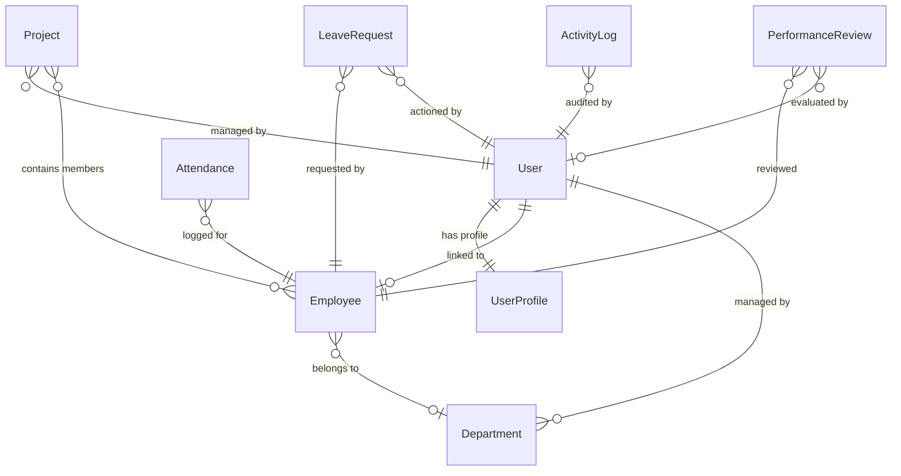
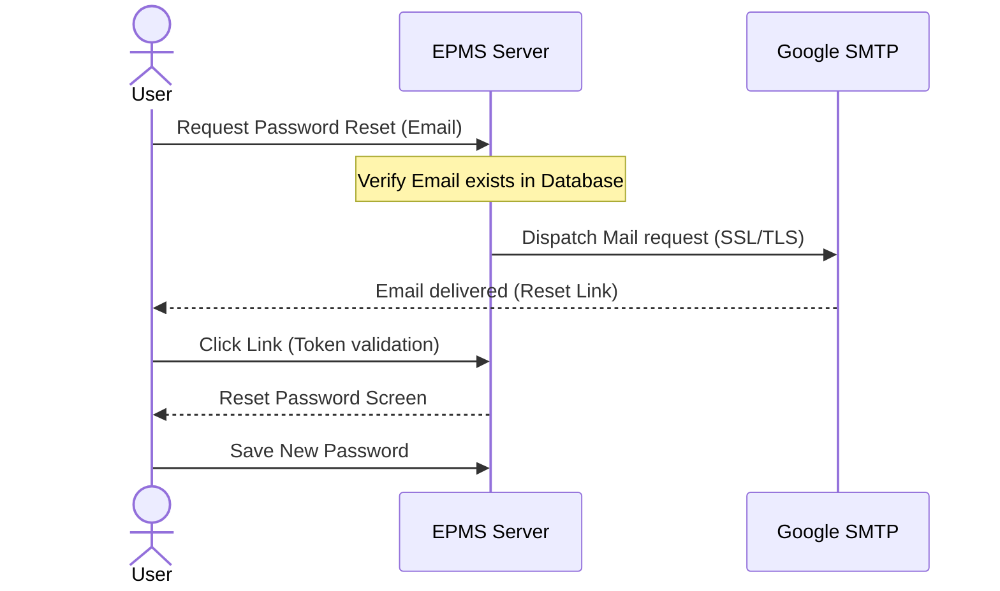
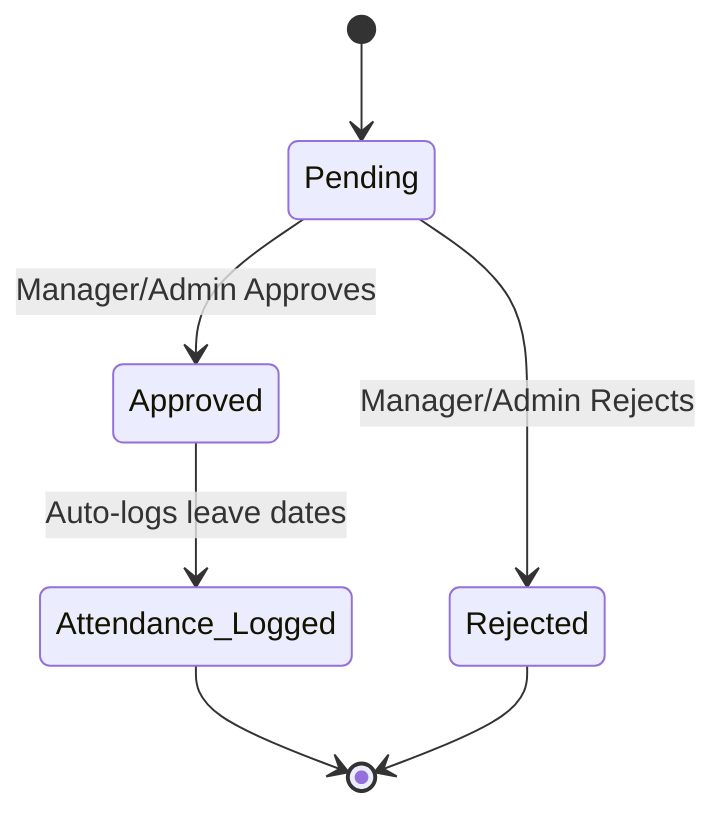

# Employee Performance Management System (EPMS) - Workflow Documentation

This document describes the design system, operational workflows, role permissions, analytics rendering, and technical layout of the Employee Performance Management System (EPMS).

---

## 1. System Architecture

The EPMS is designed as a **Multi-Page Application (MPA)** using Django's template engine, combined with premium modern frontend libraries to provide a desktop-grade dashboard experience.

* **Backend Engine:** Django (Python) handles request-response routing, form validation, ORM operations, role authorization, and server-side redirects.
* **Database:** SQLite serves as the data layer, structured with indexes for fast queries.
* **Frontend Design System:**
  * **Tailwind CSS:** Responsive grid layouts, subtle gradients, blur filters, and transitions.
  * **Font Awesome (v6):** Visual indicators in sidebars, KPI blocks, and actions.
  * **SweetAlert2:** Interactive toasts for alert responses and custom prompt modals.
  * **DataTables (jQuery):** Fast client-side sorting, pagination, and multi-column searches on listings.
  * **D3.js (v7):** Mathematical SVG data visualization for trends, allocation donut segments, and tree graphs.

### Project Directory Layout

```text
employee_performance_system/
├── core/
│   ├── management/
│   │   └── commands/
│   │       └── seed_data.py       # Initial seed script for admin, managers, and employees
│   ├── admin.py                   # Django admin registrations
│   ├── apps.py                    # App configuration
│   ├── forms.py                   # Custom forms (Employee, Department, Project, Leave, Reviews)
│   ├── models.py                  # Database Schemas (UserProfile, Department, Employee, etc.)
│   ├── tests.py                   # Automated test cases
│   ├── urls.py                    # Core routing paths
│   └── views.py                   # View controller implementations (RBAC protected)
├── performance_system/
│   ├── settings.py                # Global Django configurations (SMTP, DB, Static setup)
│   ├── urls.py                    # Main app routing
│   └── wsgi.py / asgi.py          # WSGI/ASGI gateways
├── static/
│   ├── css/
│   │   └── custom.css             # Tailored styling enhancements
│   └── js/
│       └── main.js                # Core JS logic for DataTables, SweetAlert2 alerts, responsive menu
├── templates/
│   ├── base.html                  # Core layout structure
│   ├── core/                      # Core dashboards, forms, detail views, and reports
│   └── registration/              # Custom authentication & password reset templates
├── .env                           # SMTP details and secret configurations
├── db.sqlite3                     # SQLite database file
├── manage.py                      # Django management command script
├── requirements.txt               # Dependencies file
├── project_requirements.md        # Technical requirements spec
├── prompt.md                      # Original project requirements prompt
└── workflow_documentation.md      # Workflow and system architecture manual
```

---

## 2. Database Schema & Relationships

The database consists of 8 core tables with key-constraint integrity:



### Model Schemas
1. **`UserProfile`:** Extends Django's `User` with phone numbers, street addresses, role flags (`ADMIN`, `MANAGER`, `EMPLOYEE`), and profile picture paths. A Django post-save signal dynamically instantiates profiles upon new user signup.
2. **`Department`:** Group organizational blocks (e.g., Engineering, Sales) with unique code keys. References a `User` manager.
3. **`Employee`:** Stores primary staff contracts (salary, designation, joining date, status). Linked to a `User` and `Department`.
4. **`Project`:** Holds tasks and teams. Includes project timeline dates, status flags, and a Many-to-Many membership field linking employees.
5. **`Attendance`:** Logs daily clock-in/out times. Status choices are constrained to `Present`, `Absent`, `Leave`, and `Half Day`. Asserts a `unique_together` constraint on `(employee, date)`.
6. **`LeaveRequest`:** Processes leave requests. Stores request reasons and maps request dates. Statuses include `Pending`, `Approved`, and `Rejected`.
7. **`PerformanceReview`:** Core metrics ledger. Evaluates 5 star scores (1 to 5) for Productivity, Attendance, Teamwork, Communication, and Technical Skills. Saves an overall average score automatically.
8. **`ActivityLog`:** Chronological system operations audit trail (operator user, action, details, timestamp).

---

## 3. Role-Based Access Control (RBAC)

Authorization is enforced at both the view level (using a custom `role_required` decorator) and template level (using conditional template logic).

| System Resource / View                |      Admin       |     Manager      |         Employee         |
| :------------------------------------ | :--------------: | :--------------: | :----------------------: |
| **System Settings & Audit Trail**     | Full Read/Write  |      Denied      |          Denied          |
| **Role Adjustments & Status Toggles** | Full Read/Write  |      Denied      |          Denied          |
| **Department CRUD**                   | Full Read/Write  |    Read-Only     |        Read-Only         |
| **Employee Creation / Deletion**      | Full Read/Write  |      Denied      |          Denied          |
| **Employee Details View**             |    Full Read     |    Full Read     | Read-Only (Self Profile) |
| **Project CRUD**                      | Full Read/Write  | Full Read/Write  |   Read-Only (Assigned)   |
| **Performance Review CRUD**           | Full Read/Write  |  Create / Edit   | Read-Only (Self Profile) |
| **Leave Approvals & Actions**         | Approve / Reject | Approve / Reject |          Denied          |
| **Leave Application**                 |      Denied      |      Denied      |      Apply / Track       |
| **Attendance Check-in / Out**         |      Denied      |      Denied      |      Check-in / Out      |
| **System Reports & CSV Exports**      |    Export All    |   Export Team    |          Denied          |

---

## 4. Module Operational Workflows

### 1. Password Reset & SMTP Email Workflow

* **Security Validation:** The link contains a one-time token and base64-encoded user ID. Django verifies token validity and expiration.
* **Fallback Safety:** If no SMTP credentials are set in the `.env` file, the system defaults to printing reset links directly in the development server console.

### 2. Employee Creation Flow
When an administrator creates a new employee:
1. A Django `User` object is created with a secure hashed password.
2. The user's role is set to `EMPLOYEE` or `MANAGER` in their `UserProfile`.
3. An `Employee` profile is created containing salary, designation, and department details.
4. An audit log (`ActivityLog`) is saved: `"Created employee profile: Full Name (EMP-ID)"`.

### 3. Attendance Workflow
* **Check-In:** When employees click **Check In**, the system captures the local server time and saves a new `Attendance` record with status `PRESENT`.
* **Check-Out:** When they click **Check Out**, the system updates the check-out field.
* **Leave Syncing:** If a leave request is marked `APPROVED`, a background task runs to create `Attendance` records for the request period, marking them as `LEAVE`.

### 4. Leave Approval Flow


---

## 5. D3.js Interactive Analytics Dashboard

The `/analytics/` portal fetches aggregated metrics from the `/api/dashboard-data/` JSON endpoint and mounts 7 custom interactive charts using **D3.js**:

1. **Department Allocation (Donut Chart):**
   * Computes outer/inner radius slices.
   * Renders color schemes to depict employee density.
   * Features hover paths that scale outward and center totals.
2. **Attendance Trends (30-Day Line Chart):**
   * Scales days along the X-axis and percentage rates (0% - 100%) on the Y-axis.
   * Applies a linear opacity gradient fill under the curves.
   * Plots circles on points that scale up on hover and display tooltips.
3. **Monthly Attendance Analytics (Grouped Bar Chart):**
   * Groups vertical bar segments (Present, Absent, Half Day, Leave) for the last 6 months.
   * Utilizes range band scales to space grouped segments.
4. **Performance Score Trends (Line Graph):**
   * Tracks historical review dates.
   * Connects review ratings over time to map performance.
5. **Project Completion Stats (Horizontal Bar Chart):**
   * Displays status tags (Planning, Active, Completed, On Hold) vertically.
   * Animates bar widths from left to right on page load.
6. **Organization Hierarchy Tree (Collapsible Tree Layout):**
   * Uses D3's tree node-link layout structure.
   * Displays hierarchical lines from Admins -> Managers -> Employees.
   * Supports expanding and collapsing tree branches on node clicks.
7. **Performance Comparison (Multi-Bar Comparison Chart):**
   * Displays side-by-side metric bar evaluations for core competencies (Productivity, Attendance, Teamwork, Communication, Technical Skills) for comparing employee performance.

---

## 6. Security & Verification Logs

### Session Auditing
EPMS tracks all system operations. Security actions are logged in the `ActivityLog` table and displayed on the Admin Settings page:
* **Authentication Logs:** User Logins and Logouts are tracked automatically using Django's built-in authentication signals.
* **Operational Logs:** Custom logs are triggered inside views upon creating departments, updating projects, actioning leaves, or submitting reviews.

### Code Quality & Unit Tests
To verify all operations work correctly, run the Django test suite:
```bash
.venv/bin/python manage.py test
```
The test suite validates:
* Database signals (e.g., auto-creating user profiles).
* Permission checking (e.g., denying access to unauthorized roles).
* Attendance logging workflows.
* Performance review averages.
* Audit trail logging.

---

## 7. Developer Setup Guide

To run the project locally:

### 1. Initialize Virtual Environment
```bash
python -m venv .venv
source .venv/bin/activate
pip install -r requirements.txt
```

### 2. Configure Environment Variables
Create a `.env` file in the project root:
```env
EMAIL_BACKEND=django.core.mail.backends.smtp.EmailBackend
EMAIL_HOST=smtp.gmail.com
EMAIL_PORT=587
EMAIL_USE_TLS=True
EMAIL_HOST_USER=your-email@gmail.com
EMAIL_HOST_PASSWORD=your-16-char-app-password
```

### 3. Generate & Run Database Migrations
```bash
python manage.py makemigrations
python manage.py migrate
```

### 4. Seed Sample Database
```bash
python manage.py seed_data
```
*Creates the following accounts:*
* **Admin:** `admin` / `admin12345` (email: `viperoflegendkiller@gmail.com`)
* **Manager:** `manager` / `manager12345`
* **Employee:** `employee` / `employee12345` (email: `shahidkhan88892@gmail.com`)

### 5. Launch Server
```bash
python manage.py runserver
```
Open your browser and navigate to `http://127.0.0.1:8000/`.
